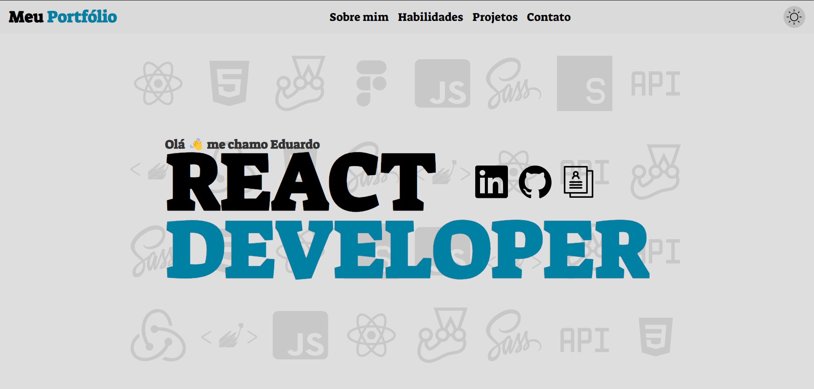

<br/>
<p align="center">
  <a href="https://github.com/Eduardo071/my-portfolio-react">
    
  </a>

  <h3 align="center">Portfolio with React.js</h3>

  <p align="center">
    Meu portfólio completo e responsivo
    <br/>
    <br/>
<a href="https://www.figma.com/file/iFUMfBvA2sAP0gatp2kKFN/porfolio?type=design&node-id=29%3A169&mode=design&t=CrxTRXufGBEK93jo-1"><strong>Veja o protótipo »</strong></a>
<br/>
    <a href="https://github.com/Eduardo071/my-portfolio-react"><strong>Leia a documentação »</strong></a>
    <br/>
    <br/>
    <a href="https://github.com/Eduardo071/my-portfolio-react/issues">Reporte um Bug</a>
    .
  </p>
</p>

     

## Sobre o projeto

[](https://my-portfolio-react-gamma.vercel.app)

Nesse projeto criei meu portfólio contendo todas informações relevantes sobre mim.

O projeto foi feito em página única, contendo as seções: sobre, habilidades, projetos e contato.

Tem menu responsivo(menu hamburguer) e toggler para mudança de temas, que alterna entre o modo light e o modo dark.

A seção de contato faz conexão com uma api que me entrega oos emails e mensagens que o usuário quiser enviar.

Na seção de skills, utilizei uma biblioteca para fazer o swiper, a biblioteca se chama swiper.js.

Por fim, para algumas animações, utilizei o GSAP e o ScrollTrigger como plugins facilitadores das minhas animações.

## Desenvolvido com

Esse projeto foi desenvolvido utilizando:


* [Figma](https://www.figma.com)
* [React.js](https://react.dev)
* [React-Router](https://v5.reactrouter.com/)
* [Styled-components](https://styled-components.com)
* [Context-api](https://react.dev/learn/passing-data-deeply-with-context)
* [CSS](https://developer.mozilla.org/en-US/docs/Web/CSS)
* [TypeScript](https://www.typescriptlang.org)
* [Swiper.js](https://swiperjs.com)
* [EmailJS](https://www.emailjs.com)
* [GSAP](https://greensock.com/gsap/)
* [ScrollTrigger](https://greensock.com/scrolltrigger/)

## Introdução

Para instalar esse projeto localmente em sua máquina, basta seguir o passo a passo.

### Pré requisitos

Você irá precisar ter alguns pré-requisitos para instalar o projeto localmente, como:

* npm

você irá precisar instalar o gerenciador de pacotes NPM.

```sh
npm install npm@latest -g
```

### Instalação

1. Com o NPM instalado, faça o download do arquivo ZIP do projeto.

2. Extraia o arquivo .zip para algum local, através do terminal, navegue até a pasta, caso a pasta esteja na raiz do disco local C por exemplo, basta dar o seguinte comando:

```sh
cd /c/my-portfolio-react
```

3. Agora basta instalar as dependências do projeto.

```sh
npm install
```

4. Pronto, projeto instalado com sucesso!!

## Uso

O objetivo do projeto é entregar tudo que é necessário de informação sobre mim para recrutadores que quiserem ver meu porfólio e também para treinar e aprimorar minhas skills.

## Licença

Distributed under the MIT License. See [LICENSE](https://github.com/Eduardo071/my-portfolio-react/blob/main/LICENSE.md) for more information.

## Autor

* **Eduardo071** - *Desenvolvedor Web Front-End* - [Eduardo071](https://github.com/Eduardo071) - *Protótipo e Código*